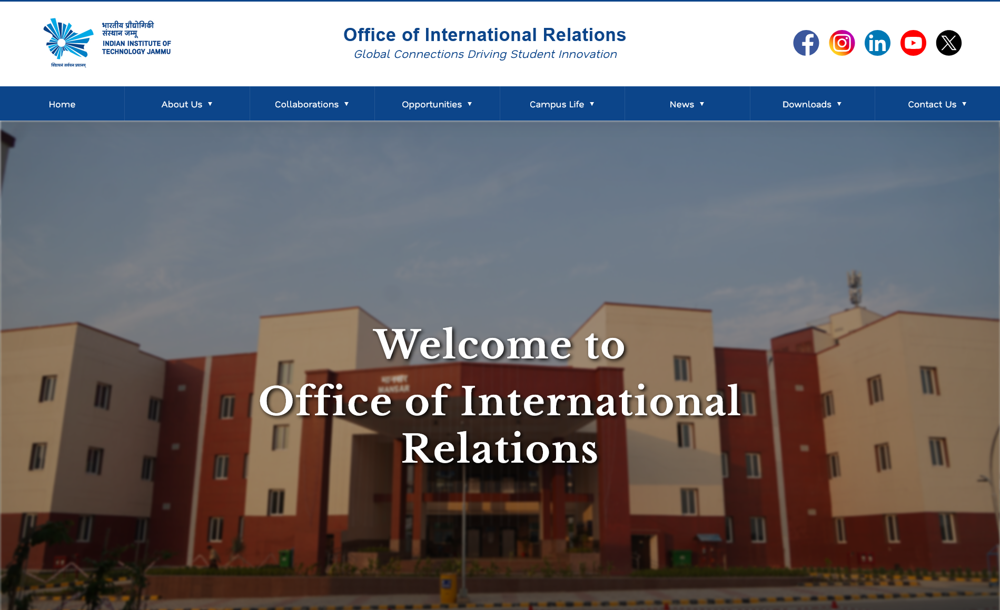

# Office of International Relations - IIT Jammu

**Global Connections Driving Student Innovation**

## Overview

This is the official website for the Office of International Relations at IIT Jammu. The platform serves as a hub for international collaborations, student opportunities, and global connectivity initiatives.

## Home Page



## Features

- **Navigation Menu**: Easy access to all major sections
  - Home
  - About Us
  - Collaborations (MOUs)
  - Opportunities
  - Campus Life
  - News
  - Downloads
  - Contact Us

- **Social Media Integration**: Connect via Facebook, Instagram, LinkedIn, YouTube, and Twitter

- **Responsive Design**: Fully functional across all devices and screen sizes

- **Key Sections**:
  - **About**: Information about the Office of International Relations
  - **Collaborations**: Details about MOUs and partnerships
  - **Opportunities**: Scholarships, exchange programs, and internships
  - **Campus Life**: Events, festivals, clubs, and sports
  - **Team**: Meet the team members
  - **Contact**: Get in touch with the office

## Project Structure

```
InternationalRelations/
├── index.html              # Home page
├── about.html              # About Us page
├── contact.html            # Contact information
├── contact-form.html       # Contact form page
├── contact-faq.html        # FAQs
├── contact.js              # Contact form logic
├── vision-mission.html     # Vision and Mission
├── mou.html                # MOUs/Collaborations
├── mou.js                  # MOU interactions
├── opportunities.html      # Opportunities & programs
├── opportunities.js        # Opportunities logic
├── events.html             # Events page
├── fests.html              # Festivals page
├── fests.js                # Festivals logic
├── clubs.html              # Clubs and societies
├── sports.html             # Sports information
├── life.html               # Campus life
├── team.html               # Team members
├── team.js                 # Team interactions
├── style.css               # Main stylesheet
├── nav.js                  # Navigation logic
├── loader.js               # Page loader animation
├── counter.js              # Counter animations
├── slider.js               # Image slider
├── flags.js                # Flag-related functionality
├── map.js                  # Map functionality
├── image/                  # Image assets
│   ├── events/
│   ├── fests/
│   └── life/
└── svg/                    # SVG assets (icons, logos)
```

## Technologies Used

- **HTML5**: Semantic markup
- **CSS3**: Responsive styling and animations
- **JavaScript**: Interactive features and dynamic content
- **Responsive Design**: Mobile-first approach

## Key Features

✨ **Loading Animation**: Smooth page loading experience

🌍 **International Focus**: Highlighting global partnerships and collaborations

📱 **Mobile Responsive**: Works seamlessly on all devices

🎨 **Modern Design**: Clean and professional interface

🔗 **Social Integration**: Connected to major social media platforms

## Getting Started

1. Open `index.html` in a web browser
2. Navigate through different sections using the menu
3. Explore opportunities, events, and team information

## Installation

No installation required. Simply clone or download the repository and open `index.html` in your browser.

```bash
git clone https://github.com/yourusername/InternationalRelations.git
cd InternationalRelations
# Open index.html in your browser
```

## Contact

**Office of International Relations**  
IIT Jammu

- 📧 Email: [Contact form available on website]
- 📱 Phone: [Available on contact page]
- 🌐 Website: [Your domain]
- 📍 Address: [Campus location]

### Follow Us

- [Facebook](https://www.facebook.com/IITJammuOfficial/)
- [Instagram](https://www.instagram.com/iit.jammu/)
- [LinkedIn](https://www.linkedin.com/school/iitjammu/)
- [YouTube](https://www.youtube.com/channel/UCNlECc7Z1sM8X6Z1sM8X6Z1s)
- [Twitter/X](https://twitter.com/IITJammu)

## License

This project is maintained by IIT Jammu. All rights reserved.

---

*Last Updated: January 2026*
